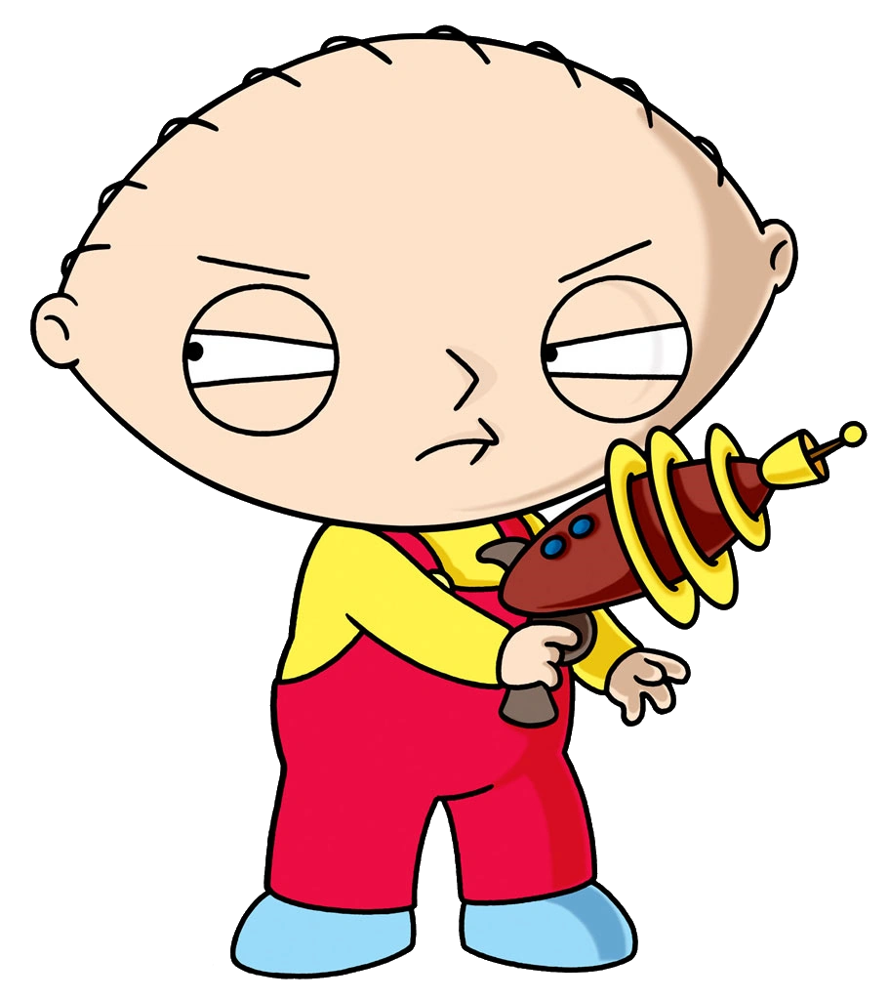

  

# Stewart

> [!WARNING]
> Stewart is currently a **Work In Progress (WIP)**. You may experience bugs.

**Stewart** is a Map and 3D viewer for the PC version of **Family Guy: Back to the Multiverse**.

The tool allows you to view, interact and export the game's map geometry.

## Installation
> [!NOTE]
> Stewart currently only supports the **PC version** of Family Guy: Back to the Multiverse and requires Windows with OpenGL 3.3 support.

1. Download the [latest version](https://github.com/sakis720/Stewart/releases/latest) from releases.
2. Launch `Stewart.exe`.
3. Enjoy!

## Contributing
Stewart is an open-source project and welcomes contributions from the community! 

*   **Bugs & Suggestions**: Feel free to [open an issue](https://github.com/sakis720/Stewart/issues) for any bugs you find or features you'd like to see.
*   **Code Changes**: Pull requests are highly encouraged!

## Credits

*   [**GLFW**](https://github.com/glfw/glfw): Window management and input handling.
*   [**Dear ImGui**](https://github.com/ocornut/imgui): Professional-grade immediate mode GUI.
*   [**GLAD**](https://github.com/Dav1dde/glad): OpenGL 3.3 loading and management.
*   [**GLM**](https://github.com/g-truc/glm): 3D mathematics for graphics.
*   [**Portable File Dialogs**](https://github.com/samhocevar/portable-file-dialogs): Native OS file and directory selection.
* [**HoExtractor**](https://github.com/barncastle/hoextractor): Parsing .ho files.

---

  <i>"What the deuce are you looking at?"</i>

